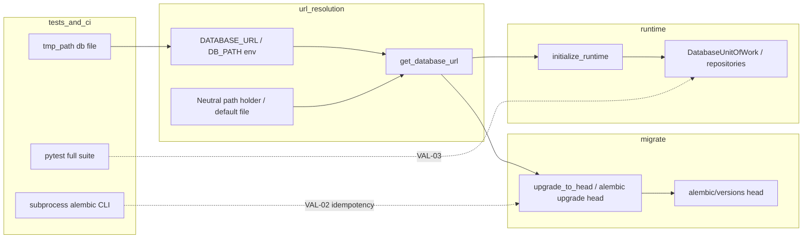

# Phase 40 — Pattern mapping (GSD pattern-mapper)

**Phase:** `40-full-migration-validation-and-sync-db-removal`  
**Inputs:** `40-CONTEXT.md`, `40-RESEARCH.md`  
**Purpose:** Classify files to touch, map each work item to existing patterns, and sketch data flow before executable plans.

---

## Files to create (net-new)

| Path | Role | Rationale (from CONTEXT / RESEARCH) |
|------|------|-------------------------------------|
| **`40-VALIDATION.md`** (this directory) | Planning / Nyquist evidence | D-13, D-14, D-15, D-16 — canonical requirement → evidence matrix; mirrors `39-VALIDATION.md` family. |
| **`tests/test_migrations.py`** (or planner-chosen name under `tests/`) | Automated **VAL-02** | RESEARCH: dedicated migration parity module is a gap; holds empty-DB → head, subprocess `alembic upgrade head` idempotency (D-02, D-04). |
| **CI / helper script** (e.g. `scripts/val04_check.sh`, `just` recipe, workflow step) — *planner picks* | **VAL-04** gate | D-11; `rg`/script restricted to `jellyswipe/` (D-05, D-07, D-08). |

---

## Files to modify (existing)

| Path | Role |
|------|------|
| **`jellyswipe/db.py`** | Remove or collapse sync `sqlite3` surface (**ADB-03**, **VAL-04**); optionally keep residue only (D-10). |
| **`jellyswipe/migrations.py`** | Decouple **`get_database_url()`** from `import jellyswipe.db` / `jellyswipe.db.DB_PATH` (RESEARCH risk #1). |
| **`jellyswipe/__init__.py`** | Test `DB_PATH` mutation on `jellyswipe.db` must align with wherever `DB_PATH` lives post-refactor. |
| **`jellyswipe/bootstrap.py`** | Stays migration-first; unchanged contract is the **analog** for “sync URL → upgrade → async runtime.” |
| **`tests/conftest.py`** | `_bootstrap_temp_db_runtime` already does Alembic + async init; `db_connection` still yields **`get_db()`** — must migrate off sync connection (VAL-03). |
| **`tests/test_db.py`**, **`tests/test_infrastructure.py`** | Assert / inspect `db` module; rewrite when module shrinks. |
| **`tests/test_routes_room.py`**, **`tests/test_routes_sse.py`**, **`tests/test_routes_xss.py`**, **`tests/test_error_handling.py`** | Direct `get_db` / `get_db_closing` usage. |
| **`tests/test_auth.py`**, **`tests/test_dependencies.py`**, **`tests/test_db_runtime.py`**, repository tests | `DB_PATH` monkeypatch patterns; keep consistent with new URL/path holder. |
| **`REQUIREMENTS.md`** | Checkbox updates **after** verification (D-15), fed by `40-VALIDATION.md`. |
| **CI config** (workflow / `pyproject.toml` hooks) | D-11: minimal combo of full `pytest` (VAL-03) + VAL-04 scan. |

**Explicit non-targets (boundary):** **`alembic/env.py`**, revision scripts under **`alembic/versions/`**, and test-tooling `sqlite3` — exempt or out-of-scope for app-layer ban (D-05, D-06).

---

## Role classification

| Kind | Items |
|------|--------|
| **Runtime app (async boundary)** | `jellyswipe/db_runtime.py`, `jellyswipe/db_uow.py`, `jellyswipe/dependencies.py` (`get_db_uow`) — already the “good” path for requests. |
| **Legacy sync seam (remove)** | `jellyswipe/db.py`: `sqlite3`, `get_db`, `get_db_closing`, sync `cleanup_expired_auth_sessions`. |
| **Migration / URL canonicalization** | `jellyswipe/migrations.py`, `jellyswipe/bootstrap.py`, `alembic.ini` + `Config` in `migrations._alembic_config`. |
| **Test harness** | `tests/conftest.py` temp DB, `upgrade_to_head`, `initialize_runtime`. |
| **Verification artifacts** | `40-VALIDATION.md`, new migration tests, optional grep script. |

---

## Closest analogs (with short excerpts)

### A. Production “migrate then async” bootstrap

`bootstrap.main` is the reference flow: resolve sync URL → **`upgrade_to_head`** → **`initialize_runtime`** on the async URL.

```13:21:jellyswipe/bootstrap.py
def main() -> None:
    """Migrate the target database, initialize async runtime, then start Uvicorn."""
    sync_url = get_database_url()
    async_url = build_async_database_url(sync_url)

    upgrade_to_head(sync_url)

    try:
        asyncio.run(initialize_runtime(async_url))
```

**VAL-02 note:** New tests should prove the same invariant on a **fresh file DB**; add **subprocess** `alembic upgrade head` for operator-faithful idempotency (D-02), while in-process `upgrade_to_head` remains the closest in-repo analog for the first assertion.

### B. Programmatic Alembic upgrade (in-process)

```61:65:jellyswipe/migrations.py
def upgrade_to_head(database_url: str | None = None) -> None:
    command.upgrade(
        _alembic_config(normalize_sync_database_url(database_url or get_database_url())),
        "head",
    )
```

**Data-flow coupling to fix:** `get_database_url()` still falls back through **`jellyswipe.db.DB_PATH`**, which ties URL resolution to the module being removed or shrunk.

```48:49:jellyswipe/migrations.py
    if jellyswipe.db.DB_PATH:
        return normalize_sync_database_url(build_sqlite_url(jellyswipe.db.DB_PATH))
```

**Analog for decoupling:** the final `default_path` branch in the same function (file-relative `data/jellyswipe.db`) — extend that pattern instead of importing `jellyswipe.db` once `DB_PATH` has a neutral home.

### C. Test harness: temp DB + Alembic + async runtime

`_bootstrap_temp_db_runtime` is the **closest existing VAL-02 fixture analog** (minus subprocess and minus dedicated table/version assertions).

```120:132:tests/conftest.py
def _bootstrap_temp_db_runtime(db_path, monkeypatch):
    """Provision one temp database through Alembic plus the async runtime path."""
    import jellyswipe.db

    sync_database_url = build_sqlite_url(db_path)
    runtime_database_url = build_async_sqlite_url(db_path)

    monkeypatch.setattr(jellyswipe.db, "DB_PATH", db_path)
    monkeypatch.setenv("DB_PATH", db_path)
    monkeypatch.setenv("DATABASE_URL", sync_database_url)

    upgrade_to_head(sync_database_url)
    asyncio.run(initialize_runtime(runtime_database_url))
```

**VAL-03 blocker to replace:** `db_connection` still opens a **sync** connection via `get_db()`:

```164:168:tests/conftest.py
    _bootstrap_temp_db_runtime(db_path, monkeypatch)

    # Get a database connection and yield it to the test
    conn = jellyswipe.db.get_db()
```

Prefer async UoW / sessionmaker inside `asyncio.run`, or repository helpers consistent with Phase 39 tests (per RESEARCH).

### D. Legacy sync API (removal target)

```114:131:jellyswipe/db.py
def get_db():
    """Get a configured runtime connection."""
    if not DB_PATH:
        raise RuntimeError("DB_PATH is not configured")

    conn = sqlite3.connect(DB_PATH, check_same_thread=False)
    return configure_sqlite_connection(conn)


@contextmanager
def get_db_closing():
    """Get a database connection that auto-closes on context exit."""
    conn = get_db()
```

Async maintenance **analog** already exists alongside (keep / move, do not reimplement with `sqlite3`):

```71:80:jellyswipe/db.py
async def cleanup_expired_auth_sessions_async(
    cutoff_iso: str | None = None,
    database_url: str | None = None,
) -> int:
    """Delete expired auth sessions through the async runtime path."""
    cutoff = cutoff_iso or (datetime.now(timezone.utc) - timedelta(days=14)).isoformat()
    return await _run_async_maintenance(
        lambda uow: uow.auth_sessions.delete_expired(cutoff),
        database_url=database_url,
    )
```

### E. SQLAlchemy `run_sync` bridge (not `sqlite3`; document in 40-VALIDATION)

```74:82:jellyswipe/db_uow.py
    async def run_sync(self, fn: Callable[..., T], /, *args: Any, **kwargs: Any) -> T:
        """Run legacy sync work on the managed session connection.

        The sync callable may issue `BEGIN IMMEDIATE` or other SQLite statements,
        but it must not own the final COMMIT or ROLLBACK. The dependency boundary
        remains the single owner of transaction completion for this session.
        """

        return await self.session.run_sync(lambda sync_session: fn(sync_session, *args, **kwargs))
```

**ADB-03 alignment:** satisfies “no `sqlite3` in `jellyswipe/`”; D-12 retention vs elimination is planner discretion — if kept, record rationale under deferred / technical debt in **`40-VALIDATION.md`**.

### F. Baseline schema for table-presence checks

```15:26:alembic/versions/0001_phase36_baseline.py
def upgrade() -> None:
    op.create_table(
        "rooms",
        sa.Column("pairing_code", sa.Text(), primary_key=True),
        sa.Column("movie_data", sa.Text(), nullable=False, server_default=sa.text("'[]'")),
        ...
    )
```

Use as the reference set of table names (and optionally `alembic_version`) for **D-04** minimum assertions after `upgrade head`.

### G. Request-scoped DB dependency (unchanged pattern; contrast with tests)

`dependencies.get_db_uow` + `DatabaseUnitOfWork` remain the application analog for “all route DB work goes through async SQLAlchemy,” supporting **VAL-04**’s “no sync app DB” story for runtime code paths that already migrated in Phase 39.

---

## Data flow notes



- **Today:** `get_database_url` can read `jellyswipe.db.DB_PATH` set from tests (`monkeypatch`) or `__init__` test config — that edge must survive refactor without importing a `sqlite3`-bearing module if `db.py` is deleted.
- **Target:** URL and path defaults live in a small neutral module; **`jellyswipe/db.py`** either disappears or exports only non-`sqlite3` helpers/constants (D-10).

---

## Requirement → pattern hook

| Requirement | Primary patterns / files |
|-------------|---------------------------|
| **ADB-03** | Remove `sqlite3` from `jellyswipe/`; route maintenance through `db_runtime` + `DatabaseUnitOfWork` (excerpt D, E). |
| **VAL-02** | New test module; reuse temp-DB + URL wiring from `_bootstrap_temp_db_runtime` (C); add subprocess Alembic (D-02); schema checks vs baseline (F). |
| **VAL-03** | Full `uv run pytest`; migrate every `get_db` / `get_db_closing` / `DB_PATH` test coupling (RESEARCH inventory). |
| **VAL-04** | Scoped grep/script on `jellyswipe/` only; `dependencies` / `db_uow` stay allowed; `alembic/` and `tests/` may still mention `sqlite3` where legitimate (D-05, D-06). |

---

## PATTERN MAPPING COMPLETE
