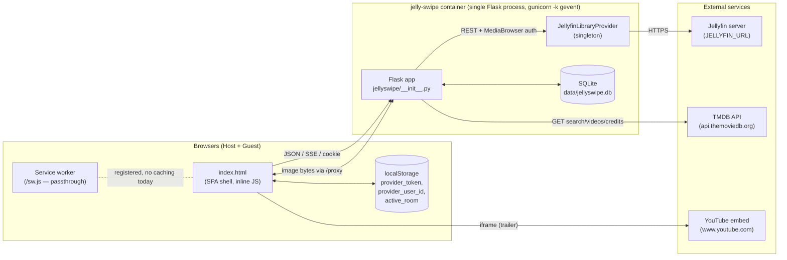
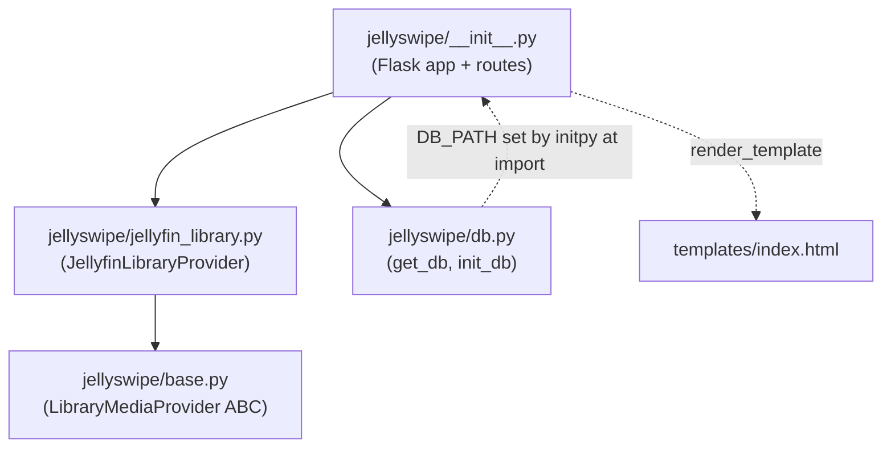
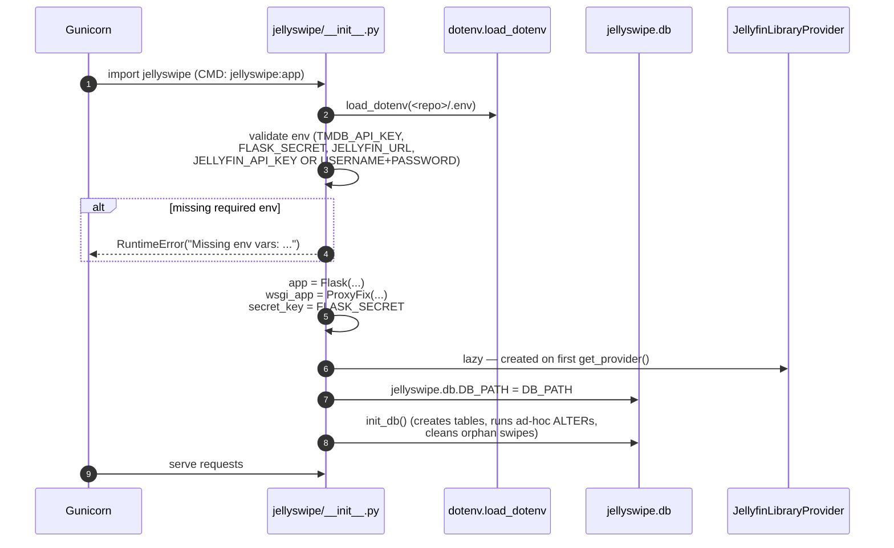
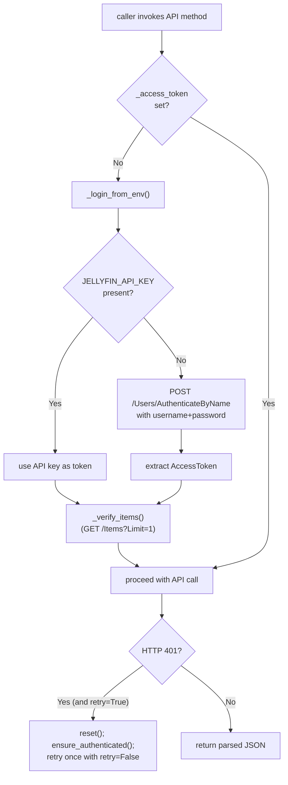
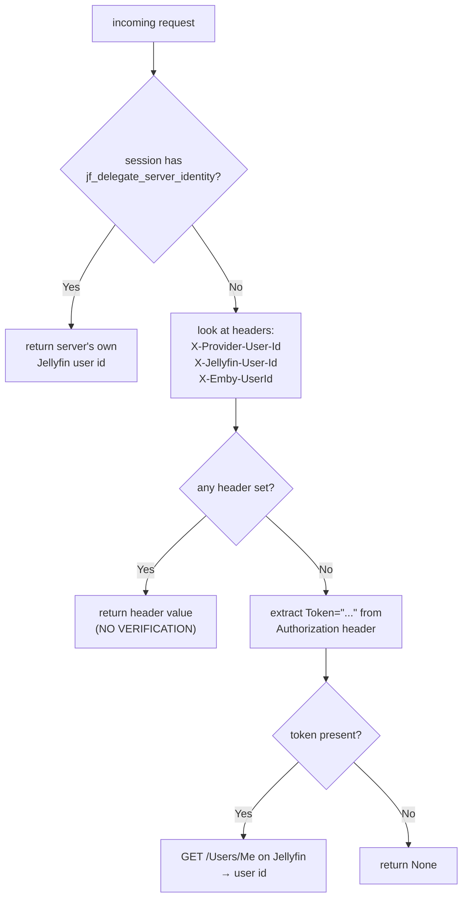
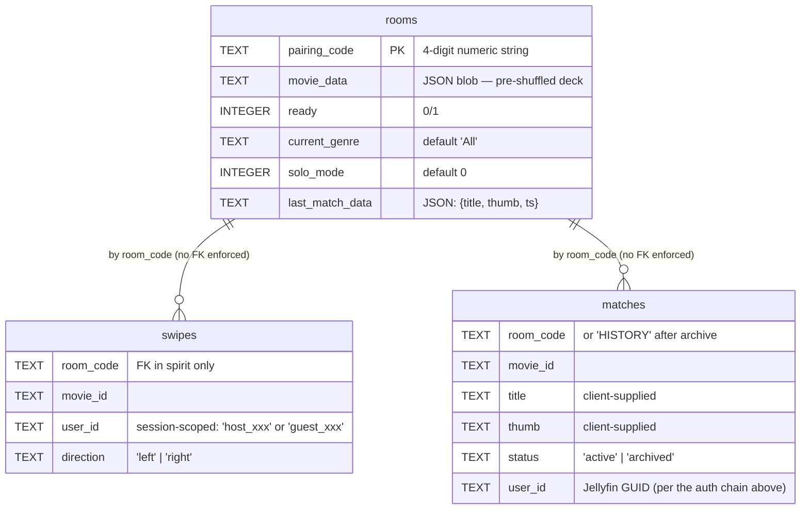
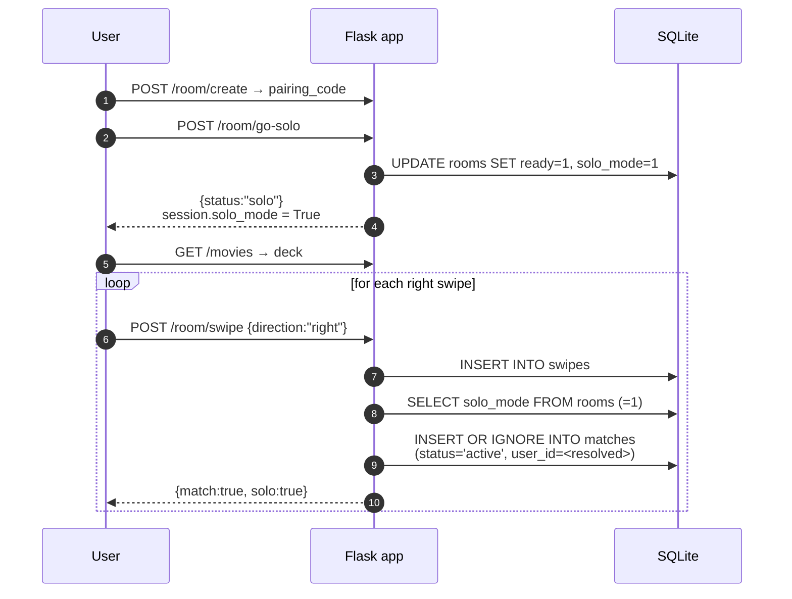
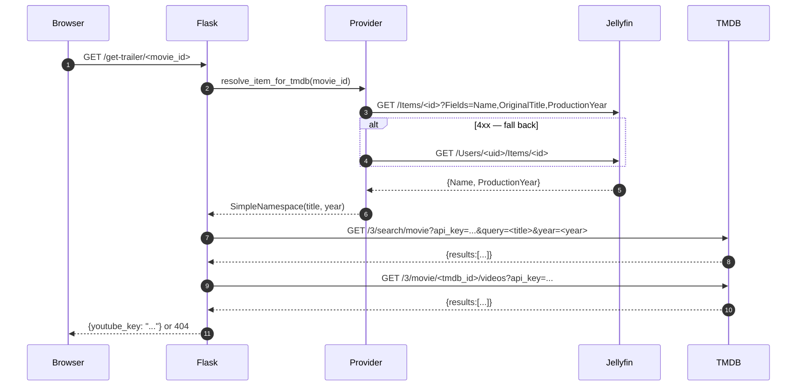
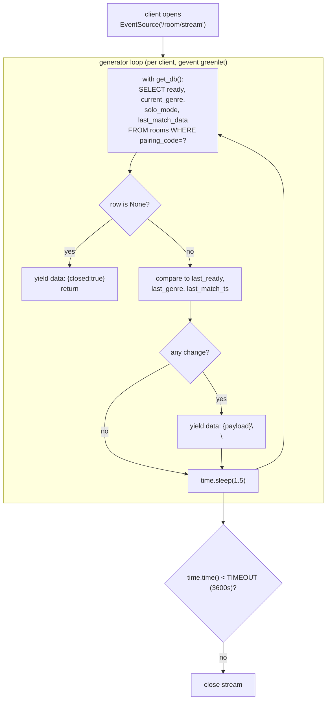
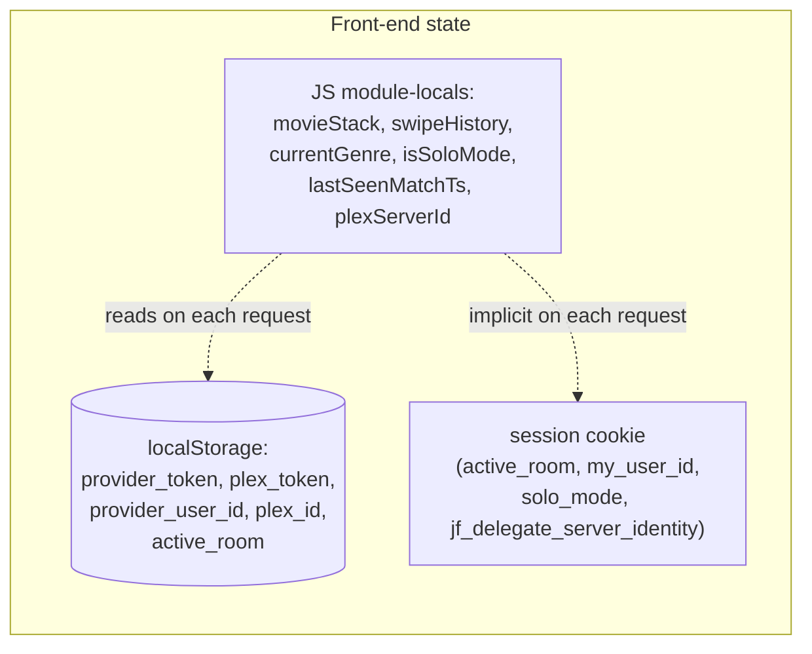

# Jelly-Swipe — Current Architecture

**Snapshot of:** code at `main` on 2026-04-25
**Scope:** describes the system **as it is today**, not as it should be. For prescriptive change proposals see [`REVIEW.md`](./REVIEW.md).

> Plex code paths are still present in the front-end shell and a few back-end strings (`/plex/server-info`, `localStorage.plex_token`, etc.) but are no longer functional — the Python provider is Jellyfin-only. Diagrams below show the live runtime; dead Plex remnants are noted in `REVIEW.md` EPIC-09.

---

## 1. System context

A single-process Flask web app that lets two people (or one person in "solo mode") collaboratively swipe through a Jellyfin library to pick a movie. Jellyfin is the catalog source of truth; TMDB is consulted for trailers and cast; SQLite holds session state.



**Key facts:**

- One container, one Python process. Gunicorn is configured with `-k gevent --worker-connections 1000` (Dockerfile:37) — concurrency comes from gevent greenlets, not workers.
- One SQLite file, mounted from the host (`./data:/app/data` in `docker-compose.yml`).
- One Jellyfin connection pool inside `JellyfinLibraryProvider` (a `requests.Session`).
- The browser holds the Jellyfin user token in `localStorage` and re-sends it on each mutation as an `Authorization: MediaBrowser ...` header.

---

## 2. Code layout

```
.
├── jellyswipe/                      # Python package (installed via uv / hatchling)
│   ├── __init__.py                  # Flask app, all routes, env validation, DB init
│   ├── base.py                      # LibraryMediaProvider ABC (single implementer)
│   ├── jellyfin_library.py          # JellyfinLibraryProvider — REST + auth + image proxy backend
│   ├── db.py                        # get_db(), init_db() (ad-hoc migrations)
│   ├── templates/index.html         # Single-page client (HTML + inline CSS + inline JS)
│   └── static/                      # icons, manifest.json, brick.png, logo, sad.png
├── data/                            # Bind-mount target in production (SQLite lives here)
│   ├── jellyswipe.db                # Live DB (gitignored)
│   ├── kinoswipe.db                 # Legacy DB (gitignored)
│   ├── sw.js                        # Service worker (served at /sw.js)
│   └── index.html, manifest.json    # Stale legacy copies (not in Docker image)
├── tests/                           # pytest suite (DB + provider only — no route tests)
├── Dockerfile                       # Multi-stage: builder runs uv sync, final copies .venv + jellyswipe/
├── docker-compose.yml               # Single service, env-driven
└── unraid_template/jelly-swipe.html # Unraid Community Apps XML (still references Plex)
```

### Module dependency graph



The `db.py` module is unusual: it exposes a module-level `DB_PATH = None`, and `__init__.py` mutates it after import (`jellyswipe.db.DB_PATH = DB_PATH`). Tests monkeypatch the same global. There is no settings object.

---

## 3. Process boot sequence



Notable side effects at import time:
- `init_db()` runs unconditionally (even in tests, hence the Flask mock in `tests/conftest.py`).
- The provider is **not** authenticated at boot; the first request that calls `get_provider()` triggers `ensure_authenticated()` which talks to Jellyfin.

---

## 4. Runtime components

### 4.1 The Flask app (`jellyswipe/__init__.py`)

- ~459 lines, owns every route, the SSE generator, env validation, the singleton provider, and the DB-path injection.
- Uses `werkzeug.middleware.proxy_fix.ProxyFix(x_for=1, x_proto=1, x_host=1, x_port=1, x_prefix=1)` — assumes exactly one trusted reverse-proxy hop.
- Sessions are Flask's default itsdangerous-signed cookies. No explicit `SESSION_COOKIE_*` config is set.

### 4.2 The Jellyfin provider (`jellyfin_library.py`)

A long-lived singleton (one per process). Holds:
- `self._base` — Jellyfin URL.
- `self._session: requests.Session` — connection pool, default `Content-Type: application/json` header.
- `self._access_token` — server-level token (API key or admin credential token).
- `self._cached_user_id`, `self._cached_library_id`, `self._genre_cache` — caches with **no TTL**, invalidated only by `reset()`.

Authentication flow inside the provider:



### 4.3 The two identity flows

The app has **two parallel identity mechanisms** and uses both at once:

1. **Server-delegated identity** — set when the user clicks "Continue" and the front-end calls `POST /auth/jellyfin-use-server-identity`. Server stores `session["jf_delegate_server_identity"] = True`. All later requests resolve the user as the server's own Jellyfin account (whatever `JELLYFIN_API_KEY` / `JELLYFIN_USERNAME` resolves to).
2. **Per-user token** — set when the user picks "Login with Jellyfin" and the front-end calls `POST /auth/jellyfin-login` with their credentials. Server proxies to `Jellyfin /Users/AuthenticateByName`, returns `{authToken, userId}`. The browser stores both in `localStorage` and re-sends `Authorization: MediaBrowser ... Token="<authToken>"` and `X-Provider-User-Id: <userId>` on each call.

`_provider_user_id_from_request()` checks them in this order:



The "trust the header" branch is the security hole called out in `REVIEW.md` EPIC-01.

### 4.4 The SQLite schema



Notes on what the schema does **not** have:
- No primary keys on `swipes` or `matches` (only a `UNIQUE(room_code, movie_id, user_id)` on `matches`).
- No declared foreign keys, no `PRAGMA foreign_keys = ON`.
- No `created_at` / `updated_at` anywhere; rooms are pruned only when the user explicitly hits "End Session".
- No `PRAGMA journal_mode = WAL` — default journal mode under gevent + multiple SSE readers.
- "Migrations" are `PRAGMA table_info` checks plus `ALTER TABLE` calls inside `init_db()` — not versioned.
- The `swipes` and `matches` `user_id` columns hold values from **different namespaces**: `swipes.user_id` is the session-scoped `host_<hex>` / `guest_<hex>` string; `matches.user_id` is the resolved Jellyfin GUID. They are never joined.

### 4.5 HTTP route surface

| Method  | Path                                | Purpose                                            | Auth required             |
|---------|-------------------------------------|----------------------------------------------------|---------------------------|
| GET     | `/`                                 | Render `index.html`                                | None                      |
| GET     | `/manifest.json`                    | PWA manifest (from `static/`)                      | None                      |
| GET     | `/sw.js`                            | Service worker (from `data/`)                      | None                      |
| GET     | `/static/<path>`                    | Static files                                       | None                      |
| GET     | `/auth/provider`                    | Returns `{provider, jellyfin_browser_auth}`        | None                      |
| POST    | `/auth/jellyfin-use-server-identity`| Sets `session["jf_delegate_server_identity"]`      | Operator-configured creds |
| POST    | `/auth/jellyfin-login`              | Proxies user creds to Jellyfin, returns token      | None (anonymous)          |
| GET     | `/genres`                           | Lists genres from Jellyfin                         | Server identity           |
| POST    | `/room/create`                      | Mints 4-digit code, fetches deck                   | Server identity           |
| POST    | `/room/join`                        | Joins existing code                                | None (cookie-only)        |
| POST    | `/room/go-solo`                     | Marks room solo + ready                            | Cookie session            |
| POST    | `/room/quit`                        | Deletes room + swipes; archives matches            | Cookie session            |
| GET     | `/room/status`                      | One-shot snapshot of room state                    | Cookie session            |
| GET     | `/room/stream`                      | SSE stream of room state changes                   | Cookie session            |
| POST    | `/room/swipe`                       | Records swipe, computes match                      | Cookie + provider id      |
| GET     | `/movies`                           | Returns deck (refreshes if `?genre=` set)          | Cookie session            |
| GET     | `/matches`                          | Lists active or archived matches for `user_id`     | Provider id (header)      |
| POST    | `/matches/delete`                   | Deletes one match for `user_id`                    | Provider id (header)      |
| POST    | `/undo`                             | Removes last swipe + match for `user_id`           | Cookie + provider id      |
| GET     | `/get-trailer/<movie_id>`           | TMDB lookup → YouTube key                          | None                      |
| GET     | `/cast/<movie_id>`                  | TMDB cast lookup                                   | None                      |
| POST    | `/watchlist/add`                    | Adds favorite via Jellyfin user token              | User token (Authorization)|
| GET     | `/proxy?path=jellyfin/<id>/Primary` | Streams poster bytes through the app               | None (only allowlist)     |
| GET     | `/plex/server-info`                 | Returns Jellyfin server id (legacy URL)            | None                      |

"Auth required" describes what the code **looks at** today, not what would be safe — see `REVIEW.md` EPIC-01.

---

## 5. Key flows

### 5.1 Boot a paired session and reach first match

```mermaid
sequenceDiagram
    autonumber
    participant H as Host browser
    participant G as Guest browser
    participant F as Flask app
    participant J as Jellyfin
    participant DB as SQLite

    H->>F: GET / (renders index.html)
    H->>F: GET /auth/provider
    F-->>H: {provider:"jellyfin", jellyfin_browser_auth:"delegate"}
    H->>F: POST /auth/jellyfin-use-server-identity
    F->>J: ensure_authenticated() → /Users/Me (cached)
    F-->>H: {userId: "..."}<br/>session.jf_delegate_server_identity = True

    H->>F: POST /room/create
    F->>J: GET /Items?ParentId=<lib>&SortBy=Random&Limit=150
    J-->>F: items[]
    F->>F: shuffle, build deck JSON
    F->>DB: INSERT INTO rooms (pairing_code, movie_data, ready=0, ...)
    F-->>H: {pairing_code: "1234"}
    H->>F: GET /room/stream (SSE opens)

    Note over G: Guest opens app, clicks "Continue"<br/>(same delegate flow as host)

    G->>F: POST /room/join {code:"1234"}
    F->>DB: UPDATE rooms SET ready=1 WHERE pairing_code='1234'
    F-->>G: {status:"success"}
    G->>F: GET /room/stream

    Note over F,DB: Both SSE generators poll rooms every 1.5s
    F-->>H: data: {ready:true, solo:false}
    F-->>G: data: {ready:true, solo:false}

    H->>F: GET /movies → deck JSON from rooms.movie_data
    G->>F: GET /movies → same deck JSON

    H->>F: POST /room/swipe {movie_id, title, thumb, direction:"right"}
    F->>DB: INSERT INTO swipes (..., direction='right')
    F-->>H: {match:false}

    G->>F: POST /room/swipe {same movie_id, direction:"right"}
    F->>DB: INSERT INTO swipes; SELECT existing right swipe<br/>by other user; INSERT INTO matches (×2 — one per user_id);<br/>UPDATE rooms.last_match_data
    F-->>G: {match:true, title, thumb}
    F-->>H: data: {last_match: {title, thumb, ts}}<br/>(via SSE on next 1.5s tick)
```

### 5.2 Solo-mode flow



### 5.3 Image proxy flow

```mermaid
sequenceDiagram
    autonumber
    participant B as Browser
    participant F as Flask
    participant P as JellyfinLibraryProvider
    participant J as Jellyfin

    B->>F: GET /proxy?path=jellyfin/<itemId>/Primary
    F->>F: regex check:<br/>^jellyfin/([0-9a-fA-F]{32}|[0-9a-fA-F-]{36})/Primary$
    alt fails regex
        F-->>B: 403 abort
    end
    F->>P: fetch_library_image(path)
    P->>P: ensure_authenticated()
    P->>J: GET /Items/<itemId>/Images/Primary?maxHeight=720<br/>Authorization: MediaBrowser Token="<server-token>"
    alt 401
        P->>P: reset(); ensure_authenticated()
        P->>J: retry once
    end
    J-->>P: image bytes + Content-Type
    P-->>F: (bytes, content_type)
    F-->>B: 200 image bytes
```

The proxy is **always signed with the operator's server token**, regardless of who the requesting browser claims to be — anyone who can reach the app can fetch any poster from the configured Jellyfin library.

### 5.4 Trailer / cast lookup (TMDB chain)



The TMDB API key travels in the URL query string. There are no `requests.get` timeouts on these calls.

---

## 6. Real-time channel: `/room/stream`

The only "push" channel is a Server-Sent Events generator that **polls SQLite every 1.5 s** and emits when meaningful columns change:



Implications:
- One SQLite connection open + closed per client per 1.5 s.
- `last_match_data` overwrites — if two right-swipe pairs land in the same 1.5 s window, only one is delivered.
- The session cookie scopes the stream to the user's `active_room`, so a user can only listen on their own room.

---

## 7. Front-end (`templates/index.html`)

A single 887-line HTML file with inline `<style>` and inline `<script>`. There is no build step.

State lives in three places:



Highlights:
- All state mutations go through `fetch(...)` to JSON endpoints; SSE only nudges the UI to re-fetch.
- `providerIdentityHeaders()` builds `X-Plex-User-ID`, `X-Provider-User-Id`, and `Authorization: MediaBrowser ...` headers from `localStorage` and attaches them to every mutation.
- DOM updates use `innerHTML` with template literals containing server data (titles, thumbs, summaries) — see `REVIEW.md` EPIC-04.
- The service worker (`data/sw.js`) just passes `fetch` through; it provides PWA installability but no offline cache. (And in the production Docker image, `data/sw.js` is not present — see `REVIEW.md` EPIC-11.)

---

## 8. Configuration

All configuration is environment-variable driven. Loaded from `<repo>/.env` via `python-dotenv` at import time, with `os.environ` falling back to whatever the container provides.

| Variable             | Required when                                                | Read by                                       |
|----------------------|--------------------------------------------------------------|-----------------------------------------------|
| `FLASK_SECRET`       | always                                                       | `__init__.py` → `app.secret_key`              |
| `TMDB_API_KEY`       | always (despite README implying optional)                    | `__init__.py` → `/get-trailer`, `/cast`       |
| `JELLYFIN_URL`       | always                                                       | `__init__.py`, `JellyfinLibraryProvider.__init__` |
| `JELLYFIN_API_KEY`   | required if `USERNAME`/`PASSWORD` are not set                | `_login_from_env()`                           |
| `JELLYFIN_USERNAME`  | required if `API_KEY` is not set; also used as preferred user| `_login_from_env()`, `_user_id()`             |
| `JELLYFIN_PASSWORD`  | paired with `USERNAME`                                       | `_login_from_env()`                           |
| `JELLYFIN_DEVICE_ID` | optional (default `jelly-swipe-jellyfin-v1`)                 | module-level constant in `jellyfin_library.py`|
| `DB_PATH`            | optional (default `<repo>/data/jellyswipe.db`)               | `__init__.py`                                 |

Validation runs at import time and raises `RuntimeError("Missing env vars: [...]")` on failure, killing the worker before it serves any traffic.

---

## 9. Deployment topology

```mermaid
flowchart LR
    User["End user (browser)"] --> RP["Reverse proxy<br/>(operator-supplied — e.g. Caddy/Traefik/NPM)<br/>terminates TLS"]
    RP --> C["jelly-swipe container<br/>(:5005, gunicorn gevent)"]
    C -. bind mount ./data:/app/data .- HostFS[("Host filesystem<br/>./data/jellyswipe.db")]
    C --> JF["Jellyfin server<br/>(reachable on operator's network)"]
    C --> TMDB["TMDB API (public)"]
    User --> YT["YouTube embed (public)"]
```

- Single container. Horizontal scale is not supported: SQLite + per-process Jellyfin auth caches + per-process SSE state can't be sharded.
- Gunicorn invocation (Dockerfile:37):
  ```
  gunicorn -b 0.0.0.0:5005 -k gevent --worker-connections 1000 jellyswipe:app
  ```
  Defaults to a single worker process; concurrency is via gevent.
- Container runs as `root` (no `USER` directive in the Dockerfile).
- Two image registries publish from CI:
  - `andrewthetechie/jelly-swipe:latest` (Docker Hub) — built on every push to `main` (`docker-image.yml`).
  - `ghcr.io/andrewthetechie/jelly-swipe:<semver>` — built on GitHub Releases (`release-ghcr.yml`).
- An Unraid Community Apps template ships in `unraid_template/jelly-swipe.html` (currently with broken Plex env defaults — see `REVIEW.md` EPIC-03).

---

## 10. Cross-cutting concerns

| Concern         | Today's reality                                                                                                              |
|-----------------|------------------------------------------------------------------------------------------------------------------------------|
| Logging         | Werkzeug's default request log, plus uncaught exceptions to stderr. No structured logging, no request id, no correlation id. |
| Error handling  | `try / except Exception as e: return jsonify({'error': str(e)}), 5xx` is the dominant pattern.                               |
| Validation      | `/proxy` regex-checks `path`. Most JSON bodies use `.get(...)` with no schema validation.                                    |
| AuthN           | Session cookie + (sometimes) Jellyfin token in `Authorization` + (sometimes) trusted client header.                          |
| AuthZ           | Resolved `user_id` is the only filter on multi-tenant queries (`WHERE user_id = ?`). See EPIC-01.                            |
| Secrets         | Env vars at runtime. Live secrets are committed to the repo's `.env` (see EPIC-02).                                          |
| Caching         | In-process untimed caches: `_access_token`, `_cached_user_id`, `_cached_library_id`, `_genre_cache`. Reset only on 401.      |
| CSRF            | None — SameSite default cookie behavior is the only mitigation.                                                              |
| Rate limiting   | None.                                                                                                                        |
| Health checks   | None — no `/healthz`, no Docker `HEALTHCHECK`.                                                                                |
| Tests           | Database (`test_db.py`) and Jellyfin provider (`test_jellyfin_library.py`) are covered. **Zero route tests.**                |
| CI              | `test.yml` runs pytest on every push; `docker-image.yml` builds `:latest`; `release-ghcr.yml` publishes semver tags.         |

---

## 11. Quick reference: where each thing lives

| If you want to change…                       | Edit…                                                            |
|----------------------------------------------|------------------------------------------------------------------|
| A REST endpoint                              | `jellyswipe/__init__.py` (one file)                              |
| How matches are computed                     | `jellyswipe/__init__.py` → `swipe()`                             |
| Deck composition / genre normalization       | `jellyswipe/jellyfin_library.py` → `fetch_deck`, `list_genres`   |
| Image proxy allowlist                        | `jellyswipe/__init__.py` (`/proxy`) **and** `jellyfin_library.py` (`_JF_IMAGE_PATH`) — duplicated |
| Schema or "migrations"                       | `jellyswipe/db.py` → `init_db()`                                  |
| The whole UI                                 | `jellyswipe/templates/index.html`                                |
| Service worker / PWA install                 | `data/sw.js`, `jellyswipe/static/manifest.json` (duplicated in `data/manifest.json`) |
| Container build                              | `Dockerfile`                                                     |
| Container runtime                            | `docker-compose.yml`                                             |
| Unraid Community Apps listing                | `unraid_template/jelly-swipe.html`                               |
| CI                                           | `.github/workflows/{test,docker-image,release-ghcr}.yml`         |

---

*Last updated: 2026-04-25. Companion document: [`REVIEW.md`](./REVIEW.md) (security & architecture issues identified during this review).*
