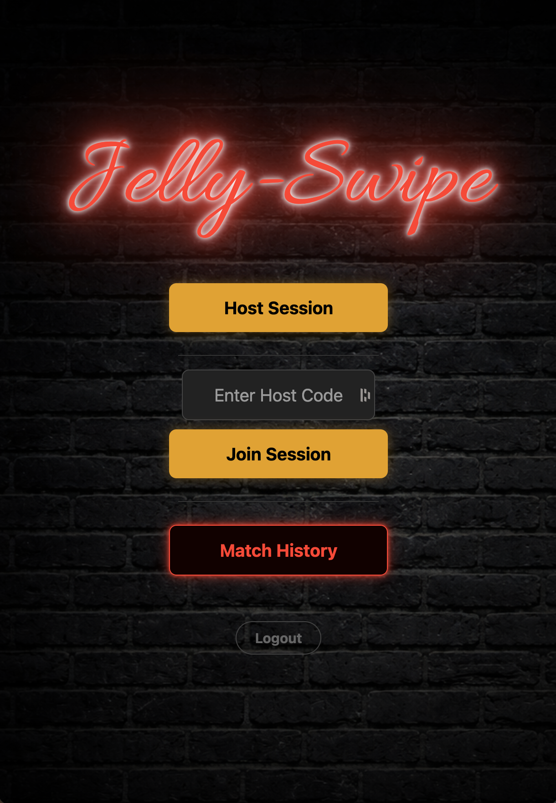
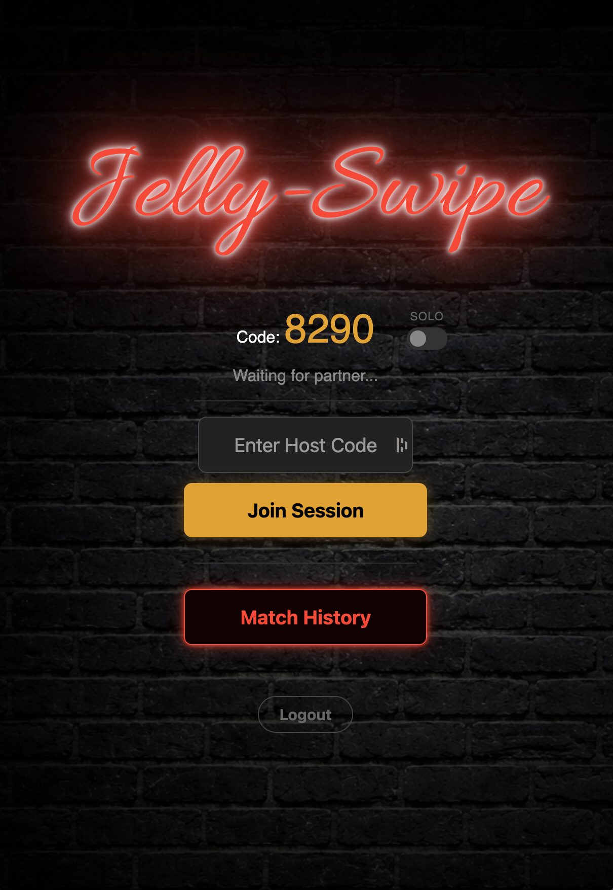
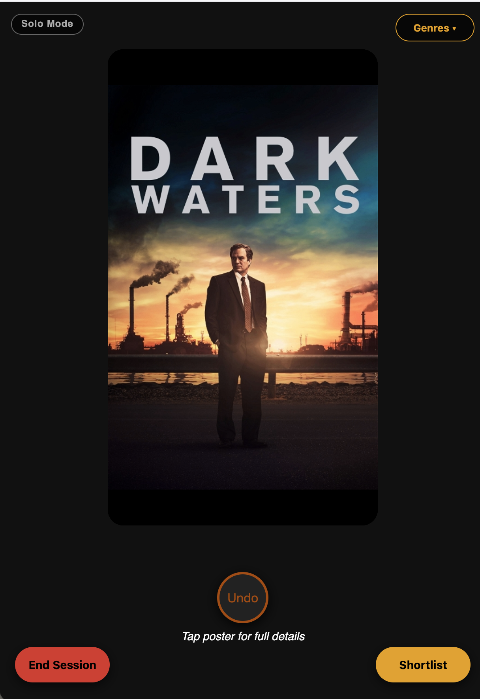
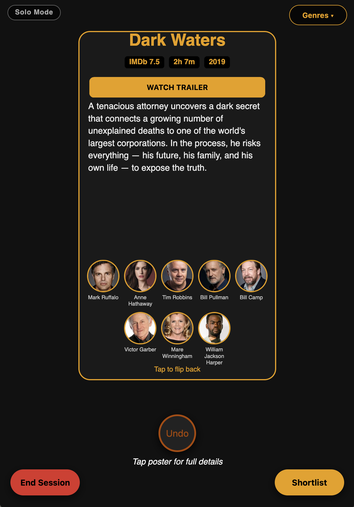
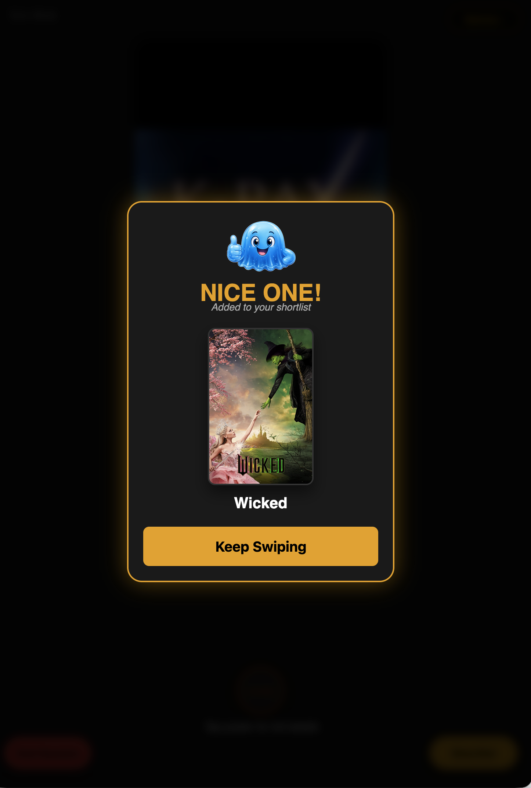

# Jelly-Swipe

<p align="center">
    <a href="https://github.com/andrewthetechie/jelly-swipe" target="_blank">
        
    </a>
    
    
    <br />
    <a href="https://github.com/andrewthetechie/jelly-swipe/issues"></a>
    
    
    <br />
</p>

Always trying to decide on a movie to watch together?, This may be the fun solution you've been looking for.
Dating app style swipe right for like swipe left for nope, If you both swipe right on the 
same movie, IT'S A MATCH!!

This project was forked to support Jellyfin from [Bergasha/kino-swipe](https://github.com/Bergasha/kino-swipe) which supports Plex. Make sure to check kino-swipe out if you use Plex for your media server.

## Screenshots

<details>
<summary>Click to expand screenshots</summary>

<br>







</details>

## Features

- **Jellyfin Integration:** Connects directly to your server to pull random movies.
- **Real-Time Sync:** Host a room, share a 4-digit code, and swipe with a partner instantly.
- **Visual Feedback:** Faint Red/Green "glow" overlays that react as you drag the posters left or right.
- **Select Genre:** Both sessions will stay in sync while browsing genres.
- **Add to watchlist:** Tap on each match and either open in Jellyfin or add to watchlist for later.
- **Watch trailer** Tap on the main poster in swipedeck for full synopsis and even watch the trailer.
- **PWA Support:** Add it to your Home Screen for a native app feel.
- **Match Notifications:** Instant alerts when you both swipe right on the same movie.
- **Match History** All matches live in Match History until you're ready to delete them.
- **Solo Mode** Flying solo? no worries, just host session and flick the solo toggle. (Every right swipe saves to Match History)

## Media backend: Jellyfin

This application connects directly to a **Jellyfin** server to pull random movies from your library. Target **Jellyfin 10.8+**.

### Environment variables


| Variable             | Required when                 | Description                                                                    |
| -------------------- | ----------------------------- | ------------------------------------------------------------------------------ |
| `FLASK_SECRET`       | Always                        | Flask session secret.                                                          |
| `TMDB_API_KEY`       | Always                        | TMDB API key (trailers / cast).                                                |
| `JELLYFIN_URL`       | Always                        | Base URL of your Jellyfin server (no trailing slash).                          |
| `JELLYFIN_API_KEY`   | With API key                  | API key for unattended server access.                                          |
| `JELLYFIN_USERNAME`  | With password (if no API key) | Account username for Jellyfin.                                                 |
| `JELLYFIN_PASSWORD`  | With username (if no API key) | Account password for Jellyfin.                                                 |
| `JELLYFIN_DEVICE_ID` | Optional                      | Stable device id string sent with Jellyfin auth headers (default is built-in). |


### Minimal `.env` example

```env
JELLYFIN_URL=http://your-jellyfin-host:8096
JELLYFIN_API_KEY=your-jellyfin-api-key
TMDB_API_KEY=your-tmdb-v3-key
FLASK_SECRET=long-random-string
```

Alternatively, use username/password authentication instead of API key:

```env
JELLYFIN_URL=http://your-jellyfin-host:8096
JELLYFIN_USERNAME=your-username
JELLYFIN_PASSWORD=your-password
TMDB_API_KEY=your-tmdb-v3-key
FLASK_SECRET=long-random-string
```

## Requirements

- **Media backend:** Jellyfin — see [Media backend: Jellyfin](#media-backend-jellyfin) and the env table above.
- **TMDB API key** — required at startup (trailers/cast); keep the key private.
- **HTTPS/Reverse Proxy:** To "Install" the app as a PWA on your phone so it looks like an app, you must access it over an HTTPS connection. If you access it over local ip, it will work in the browser but when added to homescreen it will just act as a shortcut not like an app.

### TMDB API instructions

Only required if you want trailers to work on the rear of the movie posters.

1. Create a free TMDB Account

If you don't already have one, you need to register on the TMDB website:

Go to themoviedb.org/signup.

Verify your email address to activate the account.

1. Access the API Settings

Once logged in:

Click on your Profile Icon in the top right corner of the screen.

Select Settings from the dropdown menu.

On the left-hand sidebar, click on API.

1. Create an API Key

Under the "Request an API Key" section, click on the link for Create.

You will be asked to choose a type of API key. Select Developer.

Accept the Terms of Use.

Fill out the form: * Type of Use: Personal/Educational.

Application Name: Jelly-Swipe.

Application URL: (You can put localhost or your server's IP).

Application Summary: "An app to help find movies to watch from my Jellyfin library with a Tinder-style swipe interface."

Submit the form.

1. Copy your API Key

## You will now see two different keys. For Jelly-Swipe, you need the API Key (v3 auth). It is a long string of numbers and letters.

## Deployment

### Option 1: Docker (Recommended)

Copy and paste this into your terminal. Replace the variables with your specific setup.

```bash
services:
  jelly-swipe:
    image: andrewthetechie/jelly-swipe:latest
    container_name: jelly-swipe
    ports:
      - "5005:5005"
    environment:
      - JELLYFIN_URL=http://YOUR_JELLYFIN_IP:8096
      - JELLYFIN_API_KEY=your-jellyfin-api-key
      - FLASK_SECRET=SomeRandomString
      - TMDB_API_KEY=your_copied_tmdb_key_here
    volumes:
      - ./data:/app/data
    restart: unless-stopped
```

**Option 2 — Docker Run**

```bash
docker run -d \
  --name jelly-swipe \
  -p 5005:5005 \
  -e JELLYFIN_URL=http://YOUR_JELLYFIN_IP:8096 \
  -e JELLYFIN_API_KEY=your-jellyfin-api-key \
  -e FLASK_SECRET=SomeRandomString \
  -e TMDB_API_KEY=your_copied_tmdb_key_here \
  -v ./data:/app/data \
  --restart unless-stopped \
  andrewthetechie/jelly-swipe:latest
```

### Unraid Template

For Unraid users, a pre-configured template is provided at `unraid_template/jelly-swipe.html`. This template uses Jellyfin API key authentication and requires the following environment variables:

- **JELLYFIN_URL** — Base URL of your Jellyfin server (no trailing slash)
- **JELLYFIN_API_KEY** — API key for unattended server access
- **TMDB_API_KEY** — TMDB API key for trailers and cast information
- **FLASK_SECRET** — Random secret string for Flask session security

All fields are blank by default and must be filled in by the user. The template does not expose username/password authentication options — it uses API key authentication only.

*Warning*: I don't have an unraid setup to test this template on. Use with caution and PRs from unraid users are welcome to fix any issues or improve it.


## Development

For local development and contributing, use **uv** for dependency management. This project requires **Python 3.13**.

### First-time setup

```bash
# Install dependencies from the committed lockfile
uv sync
```

This creates a virtual environment in `.venv/` and installs all dependencies from `pyproject.toml` and `uv.lock`.

### Running the app locally

**Development server (auto-reload):**

```bash
uv run python -m jellyswipe
```

**Production-style server (for testing):**

```bash
uv run gunicorn -b 0.0.0.0:5005 -k gevent --worker-connections 1000 jellyswipe:app
```

### Managing dependencies

**Add a new dependency:**

```bash
uv add <package-name>
```

**Update the lockfile after dependency changes:**

```bash
uv lock --upgrade
```

Commit both `pyproject.toml` and `uv.lock` when adding or updating dependencies.

### Notes

- The app is installed as a package (`jellyswipe/` layout), not a script. Run it via `uv run python -m jellyswipe` or `uv run gunicorn jellyswipe:app`.
- All production deployment uses Docker (see Deployment section above). Local dev uses uv for fast iteration.
- Distribution is Docker-only (Docker Hub and GHCR). There is no PyPI package to install via pip.

"This product uses the TMDB API but is not endorsed or certified by TMDB."


## License

Licensed under the [MIT License](./LICENSE)

## Contributing

Contributions are very welcome.
To learn more, see the [Contributor Guide](./CONTRIBUTING.md)

### Contributors

Thanks go to these wonderful people ([emoji key](https://allcontributors.org/docs/en/emoji-key)):

<!-- ALL-CONTRIBUTORS-LIST:START - Do not remove or modify this section -->
<!-- prettier-ignore-start -->
<!-- markdownlint-disable -->

<!-- markdownlint-restore -->
<!-- prettier-ignore-end -->

<!-- ALL-CONTRIBUTORS-LIST:END -->